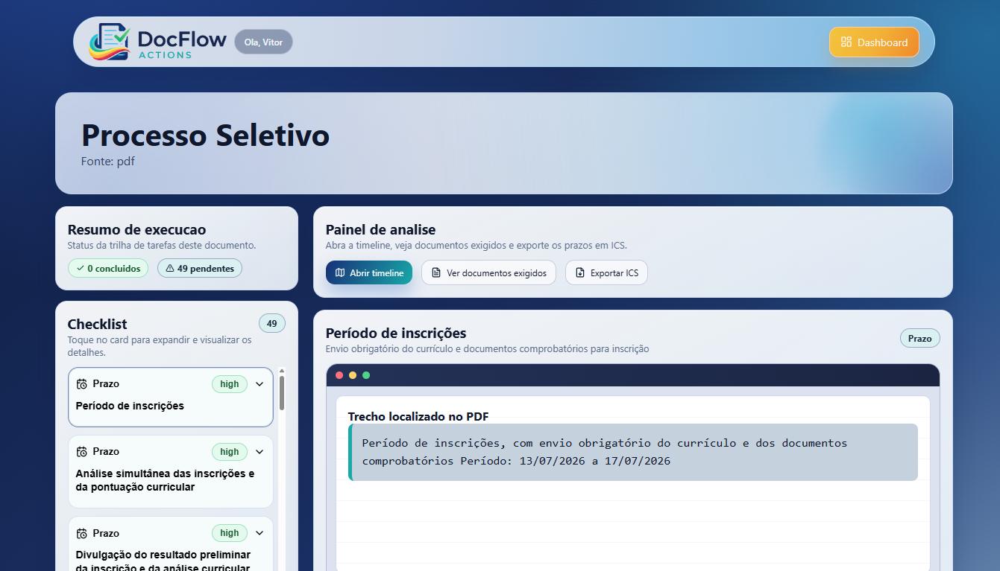
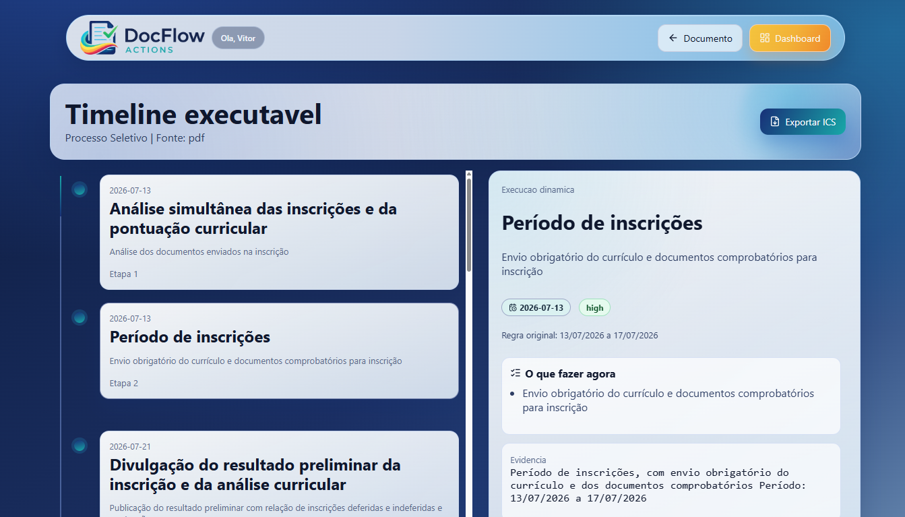
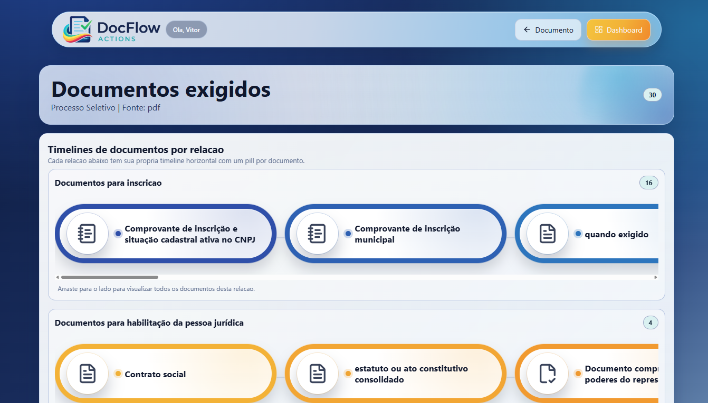
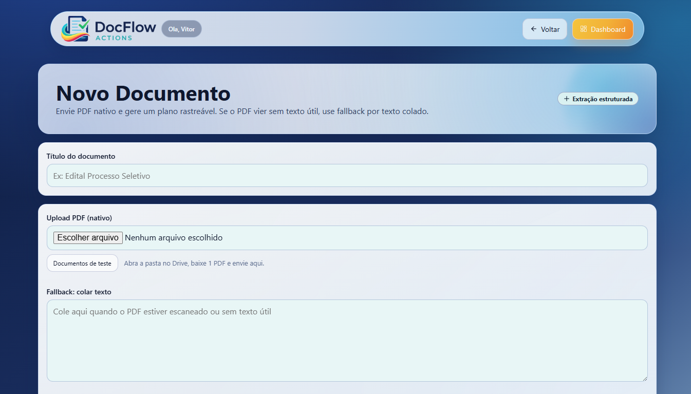
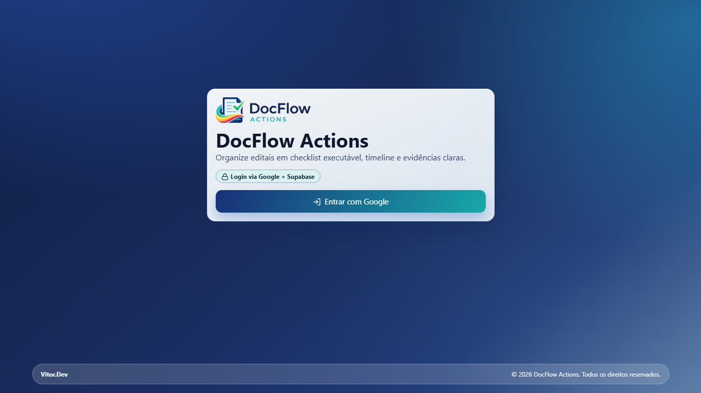
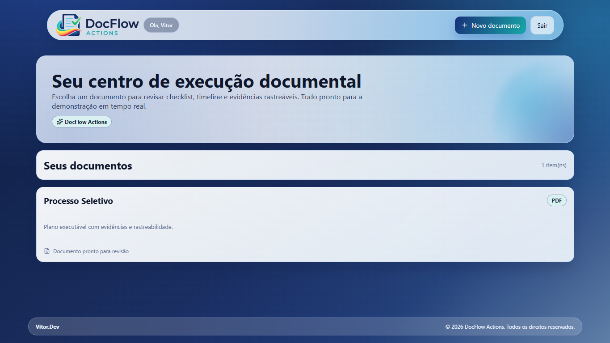
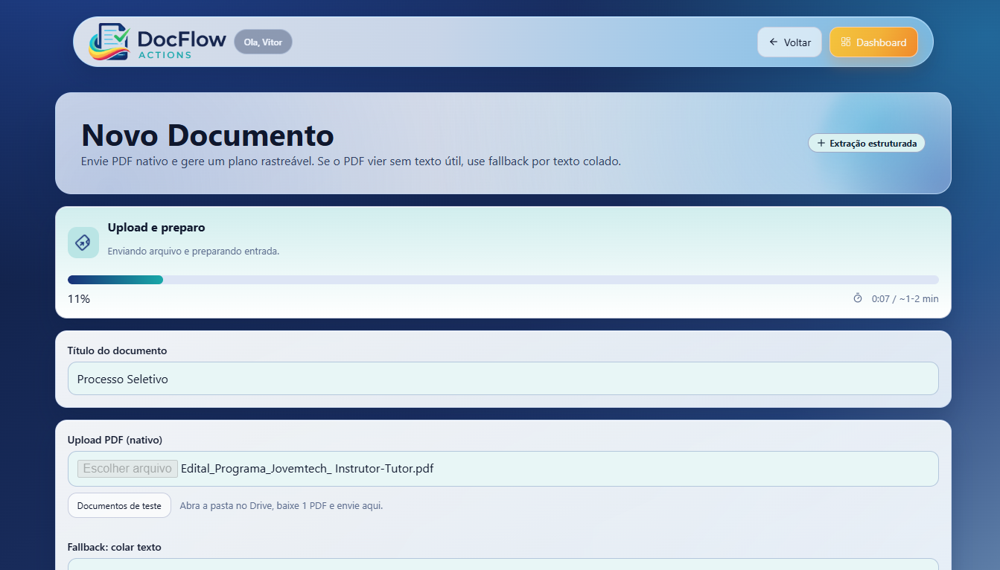

<div align="center">

# 📄 DocFlow Actions

**Transforme editais e regulamentos em um plano de ação executável.** Checklist acionável, timeline de prazos e exportação `.ics` — com rastreabilidade por evidência textual e extração estruturada via IA.

[](https://nextjs.org/)
[](https://react.dev/)
[](https://www.typescriptlang.org/)
[](https://supabase.com/)
[](https://openai.com/)
[](https://vercel.com/)

🔗 **[Acessar app ao vivo](https://doc-flow-actions.vercel.app)** · 📄 **[Guia de setup](SETUP.md)**

</div>

---

## 📸 Demonstração

> Extração real do edital de um processo seletivo (PDF de ~60 páginas): checklist, timeline de prazos e documentos exigidos gerados automaticamente, cada item com o trecho-fonte que o comprova.

| Painel de execução (checklist + evidência) | Timeline executável de prazos |
|:---:|:---:|
|  |  |
| **Documentos exigidos por relação** | **Novo documento (upload de PDF)** |
|  |  |

<details>
<summary>Mais telas — login, dashboard e processamento</summary>

| Login (Google) | Dashboard | Processamento |
|:---:|:---:|:---:|
|  |  |  |

</details>

## 1) Visão Geral

O DocFlow Actions resolve um problema recorrente de operação documental: ler documentos longos, identificar obrigações e manter controle de prazos sem perder contexto da fonte.

O sistema recebe um PDF nativo ou texto colado, extrai itens estruturados com IA, normaliza regras temporais (incluindo datas relativas), salva no Supabase com RLS e oferece uma experiência de execução no frontend.

## 2) Principais Funcionalidades

- Autenticação com Google (Supabase Auth).
- Upload de PDF direto do browser para bucket privado no Supabase Storage (suporta arquivos grandes, contornando o limite de corpo das funções serverless).
- Fallback por texto colado quando o PDF não possui texto útil.
- Extração estruturada via OpenAI com validação por schema (Zod).
- Checklist por documento com status por item (`pending`/`done`) por usuário.
- Timeline executável com resolução de datas relativas.
- Visão de documentos exigidos agrupados por relação.
- Exportação de calendário em formato ICS.
- Persistência de payload bruto de extração para auditoria/debug.

## 3) Arquitetura Técnica

### Camadas

- Frontend: Next.js (App Router), React 19, componentes em `components/`.
- Backend web: Route Handlers em `app/api/*`.
- IA: OpenAI Chat Completions com resposta em JSON.
- Dados e Auth: Supabase Postgres + RLS + Storage + OAuth Google.
- Validação: Zod para input de API e payload retornado pelo modelo.

### Fluxo principal (alto nível)

1. Usuário autentica no Google.
2. Usuário cria documento em `/document/new`.
3. Havendo PDF, o frontend faz upload direto do browser para o Supabase Storage e envia apenas o `storage_path` para `POST /api/extract` (evita o limite de 4,5 MB do corpo das funções serverless da Vercel).
4. A API baixa o PDF do Storage, extrai o texto (com fallback por texto colado) e chama a OpenAI.
5. Resultado é validado, normalizado e persistido (`documents`, `extracted_items`, `raw_extractions`).
6. Usuário executa itens no painel, atualiza status e exporta ICS.

## 4) Stack e Dependências

- Next.js `^15.1.6`
- React `^19.0.0`
- TypeScript `^5.8.2`
- Supabase SSR `^0.5.2`
- Supabase JS `^2.56.0`
- OpenAI SDK `^5.20.3`
- Zod `^3.25.76`
- pdfjs-dist `^4.10.38`
- lucide-react `^0.563.0`

## 5) Estrutura de Pastas

```text
app/
  api/
    extract/route.ts              # Extração + persistência
    export/route.ts               # Exportação ICS
    items/[itemId]/status/route.ts# Atualiza status do item
  auth/callback/route.ts          # Troca code OAuth por sessão
  dashboard/page.tsx              # Lista documentos do usuário
  document/
    new/page.tsx                  # Formulário de novo documento
    [id]/page.tsx                 # Painel com checklist/evidências
    [id]/timeline/page.tsx        # Timeline executável
    [id]/required-docs/page.tsx   # Timelines de docs exigidos
components/                       # UI e componentes de domínio
lib/
  env.ts                          # Validação de variáveis de ambiente
  prompts.ts                      # Prompt de extração
  types.ts                        # Schemas e tipos da extração
  relative-dates.ts               # Motor de datas relativas
  executable-events.ts            # Eventos executáveis para timeline/ICS
  utils.ts                        # Normalização e utilitários
  supabase/                       # Clients browser/server/middleware
supabase/migrations/
  001_init.sql                    # Schema, índices, RLS, policies
  002_storage.sql                 # Bucket e policies de storage
docs/
  regras-negocio/                 # Regras de negócio do MVP
  runbooks/                       # Runbooks de teste
```

## 6) Rotas da Aplicação

### Rotas de página

- `/` redireciona para `/dashboard` ou `/login`.
- `/login` login com Google.
- `/dashboard` listagem de documentos do usuário.
- `/document/new` criação e processamento de novo documento.
- `/document/[id]` painel de execução (checklist + evidência).
- `/document/[id]/timeline` timeline executável de prazos.
- `/document/[id]/required-docs` documentos exigidos por grupo.

### APIs

- `POST /api/extract`
  - Entrada: `multipart/form-data` (`title`, `storage_path` OU `file`, `pasted_text`, `base_date`). PDFs grandes sobem direto para o Storage e enviam apenas o `storage_path`.
  - Saída: `documentId`, `itemsCount`, `hasRelativeWithoutBase`, `inputStats`.
- `POST /api/items/[itemId]/status`
  - Entrada JSON: `{ "status": "pending" | "done" }`.
  - Saída: `{ "ok": true }`.
- `GET /api/export?documentId=<uuid>&format=ics`
  - Saída: arquivo `.ics` para download.

## 7) Modelo de Dados (Supabase)

### Tabelas principais

- `documents`
  - Documento raiz por usuário (`user_id`, `title`, `source_type`, `storage_path`, `base_date`).
- `extracted_items`
  - Itens extraídos por documento (`type`, `due_date`, `due_date_raw`, `conditional`, `dependencies`, `evidence_*`, `confidence`).
- `item_status`
  - Status por usuário e por item (`unique(item_id, user_id)`).
- `raw_extractions`
  - Payload bruto e metadados de extração por documento.

### Relacionamentos

- `documents (1) -> (N) extracted_items`
- `extracted_items (1) -> (N) item_status`
- `documents (1) -> (1) raw_extractions`

### Segurança

- RLS habilitado em todas as tabelas de domínio.
- Policies garantem isolamento por `auth.uid()`.
- Storage privado com prefixo por usuário (`<user_id>/...`).

## 8) Regras de Negócio Implementadas

### Extração e validação

- O modelo deve retornar apenas JSON no schema esperado.
- Cada item precisa conter `evidence_snippet` (mínimo 20 caracteres).
- Tipo do item: `task | deadline | required_doc | warning`.
- Em caso de JSON inválido, a API faz retry antes de falhar.

### Condicionais e dependências

- Linguagem condicional (ex.: `caso`, `se`, `desde que`, `conforme`) ativa `conditional=true`.
- Itens condicionais sem dependência explícita recebem dependência padrão.

### Datas relativas

- Datas absolutas são preservadas.
- Datas em texto (`dd/mm/yyyy` ou `yyyy-mm-dd`) são normalizadas.
- Expressões relativas suportadas: `após`, `antes`, `até X dias após`, `dias úteis`, `horas`.
- Resolução prioriza âncora no próprio documento.
- `base_date` entra apenas como fallback quando necessário.
- Sem âncora resolvível: `due_date = null` e `confidence = uncertain`.

### Exportação ICS

- Reprocessa eventos executáveis antes de exportar.
- Exporta apenas itens com `due_date` resolvida.
- Para janelas `até X dias após ...`, gera evento de início e de vencimento.
- Calendário é all-day (`VALUE=DATE`) nesta versão.

## 9) Variáveis de Ambiente

Arquivo de referência: `.env.example`.

| Variável | Obrigatória | Descrição |
|---|---|---|
| `NEXT_PUBLIC_SUPABASE_URL` | Sim | URL do projeto Supabase |
| `NEXT_PUBLIC_SUPABASE_ANON_KEY` | Sim | Chave anon pública do Supabase |
| `OPENAI_API_KEY` | Sim | Chave da API da OpenAI |
| `OPENAI_MODEL` | Não | Modelo de extração (default: `gpt-4.1-mini`) |
| `OPENAI_MAX_INPUT_CHARS` | Não | Limite de caracteres enviados ao modelo (default: `180000`) |
| `NEXT_PUBLIC_TEST_DOCS_DRIVE_URL` | Não | Link de pasta pública com PDFs de teste |

Observações:

- `OPENAI_MAX_INPUT_CHARS` é validado entre `10000` e `500000`.
- `.env.local` deve permanecer fora do Git.

## 10) Setup Local

### Pré-requisitos

- Node.js 20+
- Projeto Supabase ativo
- OAuth Google configurado no Supabase Auth
- Chave OpenAI válida

### Passo a passo

1. Instale dependências:

```bash
npm install
```

2. Copie ambiente (Linux/macOS):

```bash
cp .env.example .env.local
```

2.1 Copie ambiente (Windows PowerShell):

```powershell
Copy-Item .env.example .env.local
```

3. Preencha `.env.local` com os valores reais.

4. Execute as migrations no SQL Editor do Supabase (nesta ordem):

- `supabase/migrations/001_init.sql`
- `supabase/migrations/002_storage.sql`

5. Configure as Redirect URLs de Auth no Supabase:

- Local: `http://localhost:3000/auth/callback`
- Produção (Vercel): `https://SEU-DOMINIO.vercel.app/auth/callback`

6. Rode a aplicação:

```bash
npm run dev
```

7. Acesse `http://localhost:3000`.

## 11) Scripts Disponíveis

- `npm run dev` inicia o ambiente de desenvolvimento.
- `npm run build` gera o build de produção.
- `npm run start` inicia o app em modo produção.
- `npm run typecheck` executa a checagem de tipos sem emit.

## 12) Deploy

### 12.1 Publicar no GitHub

```bash
git add .
git commit -m "docs: atualiza README completo"
git branch -M main
git remote add origin <URL_DO_REPOSITORIO>
git push -u origin main
```

### 12.2 Publicar na Vercel

1. Importar o repositório no painel da Vercel.
2. Framework detectado: Next.js.
3. Configurar as variáveis de ambiente na Vercel:

- `NEXT_PUBLIC_SUPABASE_URL`
- `NEXT_PUBLIC_SUPABASE_ANON_KEY`
- `OPENAI_API_KEY`
- `OPENAI_MODEL`
- `OPENAI_MAX_INPUT_CHARS`
- `NEXT_PUBLIC_TEST_DOCS_DRIVE_URL` (opcional)

4. Deploy inicial.
5. Atualizar a Redirect URL no Supabase para o domínio final da Vercel.
6. Fazer redeploy se necessário.

## 13) Qualidade, Observabilidade e Troubleshooting

### Checks recomendados antes do deploy

```bash
npm run typecheck
npm run build
```

### Problemas comuns

- `Nao autenticado` nas APIs:
  - Sessão não estabelecida ou callback OAuth não configurado.
- `PDF sem texto util`:
  - PDF escaneado ou com baixa extraibilidade; usar `pasted_text`.
- `LLM retornou JSON invalido apos retry`:
  - Resposta do modelo fora do schema; revisar prompt/modelo e limite de entrada.
- Itens sem prazo no ICS:
  - `due_date` não resolvida (ver `due_date_raw`, `confidence`, dependências).

## 14) Documentação Complementar

- Regras de negócio: `docs/regras-negocio/README.md`
- Resolução de datas relativas: `docs/regras-negocio/01-resolucao-datas-relativas.md`
- Exportação ICS: `docs/regras-negocio/02-exportacao-ics.md`
- Data base fallback: `docs/regras-negocio/03-data-base-fallback.md`
- Cenários e limitações do MVP: `docs/regras-negocio/04-cenarios-mvp-e-limitacoes.md`
- Runbook de fontes de teste: `docs/runbooks/01-fontes-curadas-editais-e-documentos-teste.md`

## 15) Estado Atual do MVP

Coberto nesta versão:

- Extração estruturada com rastreabilidade.
- Normalização de prazos relativos com fallback de data base.
- Checklist operacional com status por usuário.
- Exportação ICS orientada à execução.

Limitações conhecidas:

- `dias úteis` considera apenas segunda a sexta (sem feriados oficiais).
- Eventos ICS sem horário específico e sem `VALARM`.
- Expressões jurídicas muito abertas podem permanecer `uncertain`.

---

Se você estiver em fase de deploy, este README cobre o baseline operacional para GitHub + Vercel + Supabase com o comportamento atual do projeto.
